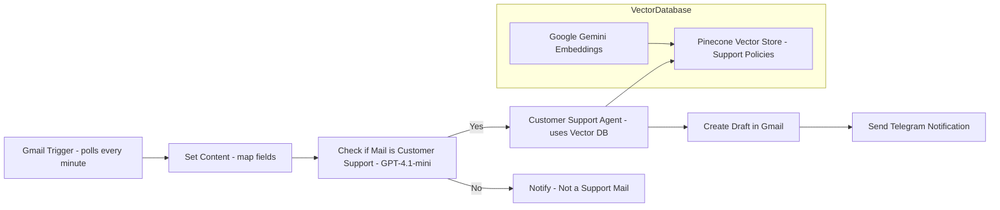

# **AI Customer Support Agent : Generates Gmail Replies from Company Policies and FAQs Stored in a Vector Database**

     

---

## 📘 Project Overview

This workflow automates **customer support email handling** using **AI and vector database retrieval**.
When a new Gmail message arrives, the system classifies whether it’s a customer-support request and, if so, generates a professional **policy-aligned draft reply** by consulting the company’s **support policies and FAQs stored in a vector database**.
Non-support emails are also logged and forwarded to the team for awareness keeping everyone informed while saving hours of manual response work.

---

## 👥 Who Benefits & Problems Solved

**Primary Beneficiaries**

* **Customers:** Receive quicker, accurate responses aligned with company policies.
* **Support Agents:** Save time drafting repetitive emails and maintain policy compliance effortlessly.
* **Operations / Managers:** Gain visibility, reduce response time, and ensure consistent communication quality.

**Problems Solved**

* Manual triaging and classification of support emails.
* Inconsistent or delayed responses from agents.
* Lack of centralized policy reference during replies.
* Time-consuming manual drafting of standard responses.

**Key Benefits**

* Smart classification with GPT-4.1-mini (support vs non-support).
* RAG-based (Retrieval-Augmented Generation) replies referencing company policy documents.
* Gmail draft creation for human review.
* Real-time team updates via Telegram.

---

## 🧭 Workflow Diagram

**Visual Workflow:**

%20Vector%20database.JPG)

**Mermaid Visual:**



---

## ⚙️ Node-by-Node Configuration

### **Step 1 — Gmail Trigger**

**Purpose:** Listens for new Gmail messages every minute.
**Parameters:**

* Poll Mode: Every Minute
* Event: Message Received
  **Action:** Starts workflow when an email arrives.

---

### **Step 2 — Set Content**

**Purpose:** Map raw Gmail JSON fields into structured variables.
**Parameters:**

* `emailBody` = `{{ $json.text }}`
* `threadID` = `{{ $json.threadId }}`
* `from` = `{{ $json.from.value[0].address }}`
  **Example Input:**

> “Hi, my product is defective. What should I do? How can I speak to a human?”
> **Action:** Prepares input for classification and agent processing.

---

### **Step 3 — Mail is Customer Support? (OpenAI GPT-4.1-mini)**

**Purpose:** Classify email as customer-support-related or not.
**Prompt:**

```
Analyze the following email and determine if it relates to customer support. 
Return {"customerSupport": true} if it matches topics like damaged products, refunds, order issues, billing, or tech support; otherwise false.
Email: {{ $json.emailBody }}
```

**Example Output:**

```json
{"customerSupport": true}
```

---

### **Step 4 — Switch Node**

**Purpose:** Route emails based on classification result.
**Condition:**

* `customerSupport` = true → Customer Support branch
* `customerSupport` = false → Not Customer Support branch

---

### **Step 5A — Customer Support Agent (Conversational Agent)**

**Purpose:** Generate a policy-aligned draft using vector database retrieval.
**System Message:**

```
You are a highly skilled and empathetic customer support agent. 
Use the "customerSupportDocs" tool (vector database) to retrieve relevant policy or FAQ details before drafting. 
Draft replies using "createDraft" and end with the sign-off:
Kelly, Customer Support ABC Corp.
```

**Connected Tools:**

* Pinecone Vector Store → Namespace: *Customer Support Policies and FAQs*
* Google Gemini Embeddings → used for indexing and retrieval
* createDraft → generates Gmail draft
  **Example Draft Output:**

```
Dear David,  
I’m sorry to hear about the defective product.  
Please share your order number and a photo of the defect so we can arrange a replacement or refund.  
Best regards,  
Kelly, Customer Support ABC Corp.
```

---

### **Step 5B — Not Customer Support (Telegram Notification)**

**Purpose:** Notify internal Telegram chat with non-support messages.
**Message Example:**

```
You received an email at 14:23 saying:

"Just wanted to say great job on the recent update!"
```

---

## 🗂️ Customer Support Policies & FAQ Vector Database

This document powers the AI agent’s contextual understanding.
It contains all the **company’s customer support policies, refund rules, shipping procedures, and FAQs** — ensuring every generated email aligns with official standards.

📄 [Download Vector Database Source — Customer Support Policies and FAQs](https://github.com/SachinSavkare/Customer-Support-Email-handling-Vector-Policies-and-FAQs-n8n/blob/main/15.%20Customer%20Support%20Policies%20and%20FAQs.pdf)

---

## 🧩 Free Workflow Template

📥 [Download Workflow Template (n8n Export)](https://github.com/SachinSavkare/Customer-Support-Email-handling-Vector-Policies-and-FAQs-n8n/blob/main/15.1%20Customer%20Support%20_%20Gmail%20Trigger.json)

---

## ✉️ Author

**Sachin Savkare**
📧 `sachinsavkare08@outlook.com`

---
